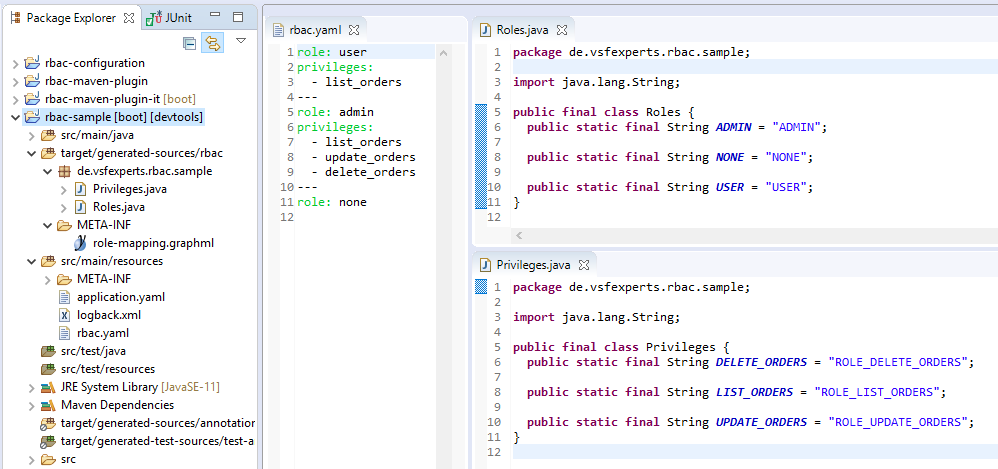
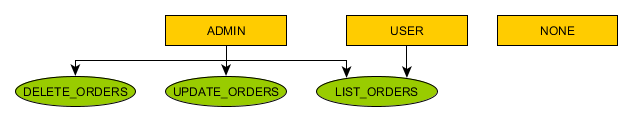

[](https://travis-ci.org/vsfexperts/rbac)
[](https://codecov.io/gh/vsfexperts/rbac)

Table of Contents
=================

   * [RBAC Services](#rbac-services)
      * [Overview](#overview)
      * [Usage](#usage)
         * [Configuration](#configuration)
         * [Maven Plugin](#maven-plugin)
            * [Generate goal](#generate-goal)
               * [Configuration Options](#configuration-options)
            * [Graph goal](#graph-goal)
               * [Configuration Options](#configuration-options-1)
         * [Sample](#sample)
         * [Spring Boot integration](#spring-boot-integration)
            * [UserDetailsService](#userdetailsservice)
            * [OAuth2](#oauth2)
            * [Application.yaml](#applicationyaml)
         * [Sample](#sample-1)
      * [Modules](#modules)

# RBAC Services

## Overview
[RBAC](https://en.wikipedia.org/wiki/Role-based_access_control) is a best practice in order to implement a permission schema. Roles 
are basically mapped to a set of privileges, which are used to determine access to certain parts of the application. The default implementation of spring security 
doesn't include this indirection. Roles are identical to privileges. This is making it hard to modify the existing structure later on. In most cases 
roles do change rarely, but the privileges do change a lot due to e.g. extensions/refactorings of the existing codebase. This project is supposed to help this case, 
as the mapping of roles to privileges is kept within the application. This project is providing some tools in order to implement this approach.

Larger organizations do often have dedicated teams in order to manage the auth infrastructure. This could be based on active 
directory groups, ldap, an oauth2 provider or something else. Normally, you'd just maintain your roles in those systems and use 
this project in order to map the roles to privileges, which are specific to your application. This is keeping things separate. 
The auth team is able to maintain access on a coarse level (roles, e.g. admin, user) and your application is able to decide what 
that means exactly (in terms of access to functionality/endpoints). You'll just have to add new privileges/map roles to them in 
the config file (see [Configuration](#configuration)), if you're extending the functionality of your app (e.g. a new report/endpoint 
is added. Who's allowed to see/use it?).

## Usage
### Configuration
This project is based on a static mapping file, which is used to map roles to privileges
``` yaml
role: user
privileges:
  - list_orders
---
role: admin
privileges:
  - list_orders
  - update_orders
  - delete_orders
---
role: none
```

### Maven Plugin
A maven plugin is provided, which will generate code or graphs off the config file.


#### Generate goal
This goal will generate classes with String constants. Those can be used with e.g. the `@Secured` annotation of Spring.
``` java
package de.vsfexperts.rbac.sample;

import java.lang.String;

public final class Roles {
  public static final String ADMIN = "ADMIN";

  public static final String NONE = "NONE";

  public static final String USER = "USER";
}

```

``` java
package de.vsfexperts.rbac.sample;

import java.lang.String;

public final class Privileges {
  public static final String DELETE_ORDERS = "ROLE_DELETE_ORDERS";

  public static final String LIST_ORDERS = "ROLE_LIST_ORDERS";

  public static final String UPDATE_ORDERS = "ROLE_UPDATE_ORDERS";
}
``` 

##### Configuration Options
| Parameter               | Purpose                                                                    |
|-------------------------|----------------------------------------------------------------------------|
|rbacFile                 | Location of mapping file, default: ${basedir}/src/main/resources/rbac.yaml |
|outputDirectory          | target folder, default: ${project.build.directory}/generated-sources/rbac  |
|packageName              | base package of generated code                                             |
|springRoles              | Generate spring compatible privileges (prefixed with ROLE_), default:true  |
|privilegeClassName       | Name of privileges java class, default: Privileges                         |
|roleClassName            | Name of roles java class, default: Roles                                   |

#### Graph goal
There's also a goal to generate a graph in graphml format, which can be edited with e.g. [yEd](https://www.yworks.com/products/yed):



##### Configuration Options
| Parameter               | Purpose                                                                              |
|-------------------------|--------------------------------------------------------------------------------------|
|rbacFile                 | Location of mapping file, default: ${basedir}/src/main/resources/rbac.yaml           |
|outputDirectory          | target folder, default: ${project.build.directory}/generated-sources/rbac            |
|reportFileName           | location of graph, relative to output folder, default: META-INF/role-mapping.graphml |

### Sample
``` xml
<plugin>
	<groupId>de.vsfexperts.rbac</groupId>
	<artifactId>rbac-maven-plugin</artifactId>
	<executions>
		<execution>
			<goals>
				<goal>generate</goal>
				<goal>graph</goal>
			</goals>
		</execution>
	</executions>
	<configuration>
		<packageName>de.vsfexperts.rbac.sample</packageName>
	</configuration>
</plugin>
```

### Spring Boot integration
The spring module is basically registering some auto configurations, which will provide support for OAuth2 and the `UserDetailsService` implementation of spring, if those are available. 
The module can also be used on its own/in standalone mode, if you want to integrate with some different authentication provider. There's basically the `RoleMapper` class and the `RbacMappingSupplier`, 
which will take care of loading the mapping file and providing a service in order to convert roles to privileges. Those are loaded by `RbacMappingAutoConfiguration`. All auto configuration classes are 
contained in package `de.vsfexperts.rbac.spring`.

#### UserDetailsService
A custom `UserDetailsService` (`RbacUserDetailsService`) is registered in order to map roles to privileges dynamically (`RbacUserDetailsServiceAutoConfiguration`).
The existing `UserDetailsService` is used as a source of data and to supply a set of roles (instead of privileges). The one from this project is decorating/wrapping the 
existing one in order to provide the mapping to privileges dynamically. This is simplifying a migration, as the existing authorities (e.g. active directory groups) 
are just treated as roles. The provided `RbacUserDetailsService` doesn't touch the other attributes of the `UserDetails` object. It's only replacing the authorities with the ones configured.

#### OAuth2
There's also support for OAuth2. The auto configuration (`RbacOauth2AutoConfiguration`) will register a custom `UserAuthenticationConverter` (`RbacUserAuthenticationConverter`), which will 
treat the value of a field in JWT as a source of roles. The default name of the field is authorities, but it can be overridden in application.yaml. The Converter can be injected into a 
`AccessTokenConverter`, e.g. the DefaultAccessTokenConverter via a setter (setUserTokenConverter())

```java

	@Autowired
	private RbacUserAuthenticationConverter rbacTokenConverter;

	@Bean
	@Primary
	public AccessTokenConverter accessTokenConverter() {
		final DefaultAccessTokenConverter tokenConverter = new DefaultAccessTokenConverter();
		tokenConverter.setUserTokenConverter(rbacTokenConverter);

		final JwtAccessTokenConverter jwtAccessTokenConverter = new JwtAccessTokenConverter();
		jwtAccessTokenConverter.setAccessTokenConverter(tokenConverter);

		return jwtAccessTokenConverter;
	}
```

#### Application.yaml
Here's the full set of configurable parameters and their default values in application.yaml:
``` yaml
rbac:
  configLocation: rbac.yaml # classpath location of configuration file
  springRoles: true # generate spring compatible privileges/constants (prefixed with ROLE_)
  roleClaimFieldname: authorities # field in JWT which is used to extract a set of roles
  userFieldname: user_name # field in JWT which is used to extract the name of the current user
``` 


### Sample
The sample is tying it all together, so it's probably a good starting point. Just launch the jar and browse to localhost:8080. The starting page is listing the users and their passwords.

## Modules
The following modules do exist:

| Module                  | Purpose                                       |
|-------------------------|-----------------------------------------------|
|rbac-configuration       | Mapping of configuration file to java objects |
|rbac-distribution        | Release of project binaries          |
|rbac-maven-plugin        | Maven code/graph generator plugin             |
|rbac-maven-plugin-it     | Integration tests of maven plugin             |
|rbac-sample              | Spring boot sample app                        |
|rbac-services            | Parent pom                                    |
|rbac-spring-boot-starter | Integration with Spring Boot                  |
